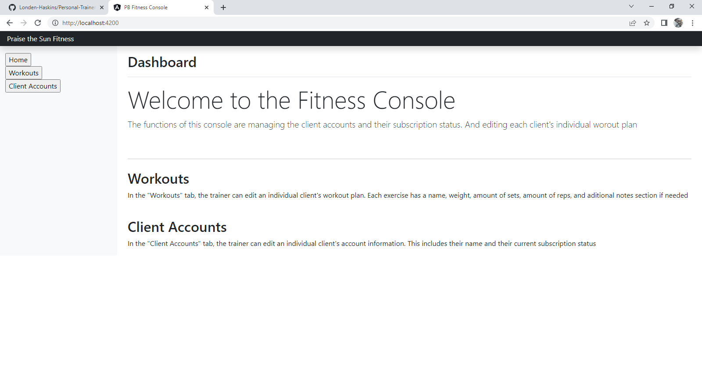
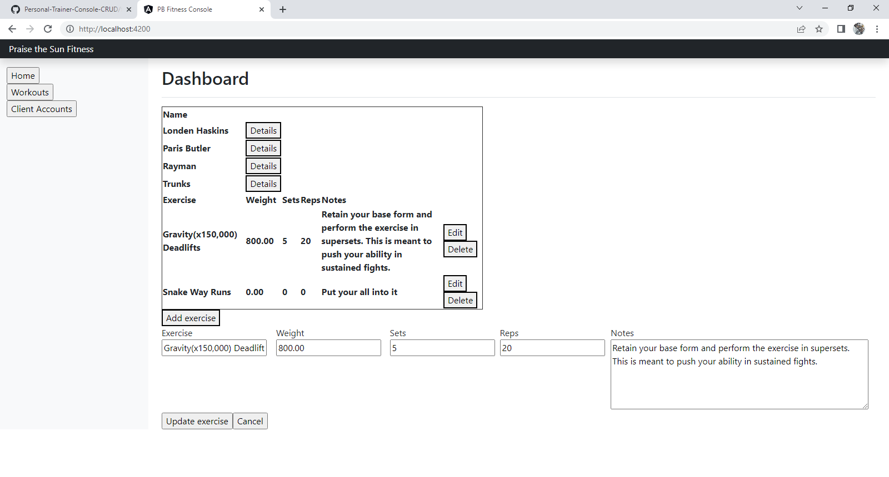

# Personal-Trainer-Console-CRUD
A web application that serves as a client management tool for personal trainers. Built with an Apache server, Angular front-end, PHP back-end, and accepts data from a SQL database.

For local testing, run the back-end PHP server on localhost port 8080

Database structure to run this app is:
"CREATE DATABASE pbfitness";

"CREATE TABLE `users` (
`id` int(4) NOT NULL AUTO_INCREMENT,
`name` varchar(50),
`subscription` varchar(50),
`workoutId` int(5) NOT NULL,
`dietId` int(5) NOT NULL,
PRIMARY KEY (id)
) ENGINE=InnoDB DEFAULT CHARSET=utf8";

"CREATE TABLE `workouts` (
`id` int(4) NOT NULL,
`exercise` text,
`weight` decimal(6,2),
`workoutId` int(5) NOT NULL,
`sets` int(3),
`reps` int(3),
`notes` text,
PRIMARY KEY (nKey)
) ENGINE=InnoDB DEFAULT CHARSET=utf8";

# Live Example
(Under maitnence)
 
Server architecture can be examined in the diagram PDF
